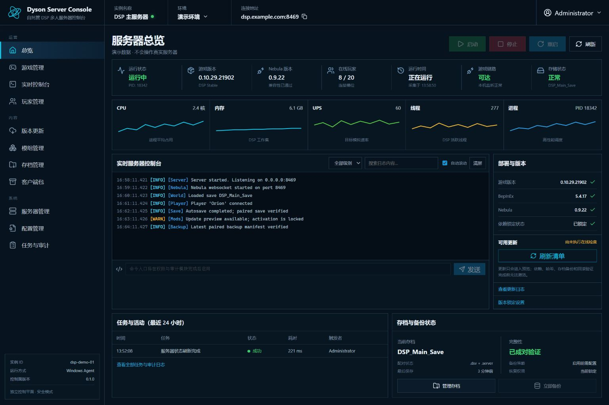

# Dyson Control

Dyson Control is a safety-first, open-source control plane for self-hosted
**Dyson Sphere Program + Nebula** multiplayer servers.

It is intentionally not a generic game panel. Its job is to understand the
parts that generic panels do not: the licensed DSP client, Nebula/BepInEx
compatibility, paired `.dsv` + `.server` saves, locked mod sets, staged updates,
client/server parity, and rollback-oriented operations.

> Project status: `0.1.0` foundation. The current release provides an
> authenticated dashboard, a demo provider, a Windows read-only status
> provider, tracked refresh jobs, and a deliberately disabled mutation surface.



## Management scope

The information architecture is designed for the entire DSP + Nebula lifecycle:

- **Game management:** process state, preflight, save requests, graceful stop,
  maintenance, restart, and rollback.
- **Version updates:** DSP, Nebula, and BepInEx compatibility, staged activation,
  health checks, and rollback.
- **Mod updates:** Thunderstore dependencies, conflicts, hashes, version locks,
  and client/server parity.
- **Player management:** online sessions, connection quality, identity, notices,
  kick/ban workflows, and audit history.
- **Save management:** atomic `.dsv` + `.server` inventory, backup, retention,
  validation, download, and guarded restore.
- **Server management:** Windows service/task health, resources, storage,
  networking, runtime prerequisites, and diagnostics.
- **Console:** structured logs, filters, search, download, and allowlisted audited
  commands.
- **Configuration:** game/Nebula/mod settings, validation, diff, staged apply,
  export/import, and rollback.
- **Client packages:** generate a client profile from the same version/mod lock
  used by the server.
- **Tasks and audit:** durable jobs, actors, results, timings, and rollback
  references.

The navigation exposes all of these workspaces now. Mutation controls remain
locked until the associated provider adapter passes its safety gates.

## Why a separate control plane?

The evaluated GSManager plugin surface is a static iframe backed by an
administrator-only generic API. It has no stable extension point for
game-specific backend routes, durable jobs, fine-grained roles, or atomic
Nebula save/update workflows. See [docs/GSM-EVALUATION.md](docs/GSM-EVALUATION.md).

GSManager may remain installed as an emergency terminal while Dyson Control is
developed, but it is not a runtime dependency.

## Safe local preview

Requirements: Node.js 24 or newer.

```powershell
npm install
npm run install:all
$env:DYSON_DEV_ADMIN_PASSWORD = 'choose-a-local-test-password'
npm run dev
```

Open `http://127.0.0.1:5173`. The development server proxies API calls to
`http://127.0.0.1:13010`.

The demo provider never touches a real game process or save.

## Production configuration

Generate a password hash locally:

```powershell
npm run hash-password -- 'a-long-unique-panel-password'
```

Then configure at minimum:

```text
NODE_ENV=production
DYSON_HOST=127.0.0.1
DYSON_PUBLIC_ORIGIN=https://game.example.com
DYSON_ADMIN_PASSWORD_HASH=scrypt$...
DYSON_SESSION_SECRET=<at least 32 random characters>
DYSON_PROVIDER=windows
DYSON_PROJECT_ROOT=C:\GameServers\DSP
```

The application deliberately binds to loopback by default. Put an authenticated
TLS reverse proxy in front of it; do not expose the Node listener directly.

## Repository layout

```text
apps/api       Fastify control-plane API, authentication, jobs, audit storage
apps/web       React/Vite operator interface
scripts/windows  Allowlisted Windows read-only collector
docs           Architecture, security model, and migration decisions
design         Accepted UI concept used as an implementation specification
```

## Roadmap

1. Read-only inventory and connectivity checks.
2. Verified save request and graceful shutdown adapter.
3. Atomic paired-save backup and guarded restore.
4. Thunderstore dependency resolver, lock preview, staged update and rollback.
5. Client profile/modpack export from the same server lock.
6. Reusable Windows Server Core installer and upgrade channel.

No game binaries, Steam credentials, Mod archives, real saves, player data, or
production configuration belong in this repository.

## License

GPL-3.0-only. See `LICENSE`.
