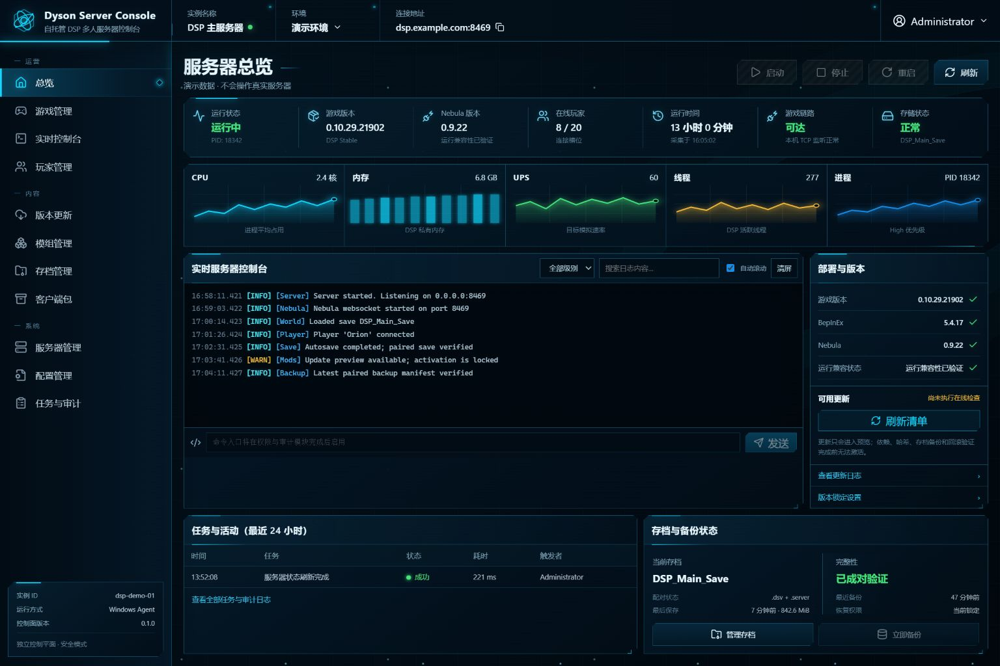
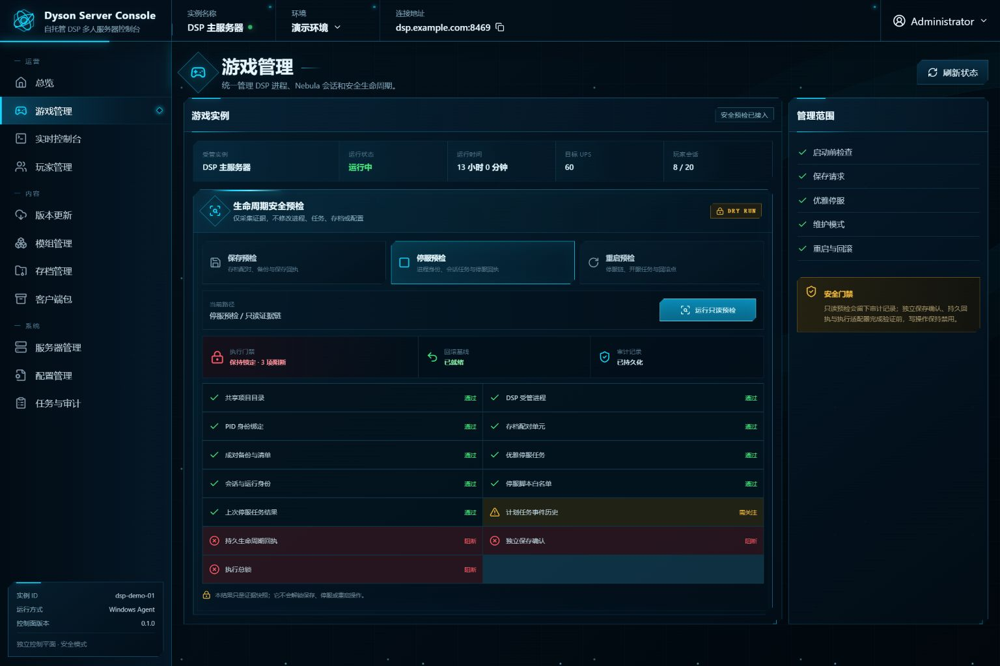

# Dyson Control

Dyson Control is a safety-first, open-source control plane for self-hosted
**Dyson Sphere Program + Nebula** multiplayer servers.

It is intentionally not a generic game panel. Its job is to understand the
parts that generic panels do not: the licensed DSP client, Nebula/BepInEx
compatibility, paired `.dsv` + `.server` saves, locked mod sets, staged updates,
client/server parity, and rollback-oriented operations.

> Project status: `0.1.0-rc.25` implementation foundation. The repository now
> contains an authenticated dashboard; bounded Windows inventory; durable,
> opt-in lifecycle transactions; paired-save catalogue and default-off,
> authenticated backup/restore workflows;
> deterministic paired-save export/import quarantine; typed configuration
> preview/apply; a redacted structured console with four fixed lifecycle
> commands; signed player observation and capability proof; Viewer/Operator/
> Administrator authorization; authenticated update discovery, offline staging,
> component activation transaction contracts, reversible mod deployment,
> reproducible client ZIP delivery; retained server telemetry; automatic
> Windows interactive-session provisioning; and a reusable Windows control-plane
> deployment transaction; plus a bounded public-source/history/artifact hygiene
> and provenance gate. The repository default remains non-mutating. None of these
> repository implementations is evidence that a target host or production
> service has been deployed, restarted, or verified.

Product scope and production readiness are tracked by the machine-validated
[`acceptance/manifest.json`](acceptance/manifest.json). See
[`docs/ACCEPTANCE.md`](docs/ACCEPTANCE.md) for evidence levels and the release
and cutover gates. A feature is not complete merely because its navigation,
preview, or API shape exists.



## Management scope

The information architecture is designed for the entire DSP + Nebula lifecycle:

- **Game management:** process state, preflight, save requests, graceful stop,
  maintenance, restart, and rollback.
- **Version updates:** DSP, Nebula, and BepInEx compatibility, staged activation,
  liveness/readiness checks, and rollback.
- **Mod updates:** Thunderstore dependencies, conflicts, hashes, version locks,
  and client/server parity.
- **Player management:** online sessions, connection quality, bounded public
  identity, join/leave history, and a signed capability matrix. Kick, ban,
  whitelist, and permission controls stay unavailable until Nebula exposes a
  verified authoritative interface.
- **Save management:** atomic `.dsv` + `.server` inventory, backup, retention,
  validation, download, and guarded restore.
- **Server management:** Windows service/task health, resources, storage,
  networking, runtime prerequisites, and diagnostics.
- **Console:** structured logs, filters, search, download, and allowlisted audited
  commands.
- **Configuration:** game/Nebula/mod settings, validation, diff, staged apply,
  export/import, and rollback.
- **Client packages:** generate a client profile from the same version/mod lock
  used by the server.
- **Tasks and audit:** durable jobs, actors, results, timings, and rollback
  references.

The navigation exposes all of these workspaces. Save backup/restore, raw save
transfer, mod deployment and component activation each retain an independent
default-off execution gate plus role and confirmation checks. Client ZIP
delivery and the four fixed console actions have bounded workflows. Player
mutation is not invented where Nebula lacks a verified interface: the signed
capability matrix keeps those controls unavailable. Production actions remain
locked until their complete adapters and target-host evidence pass the
documented gates.

The repository also includes a public, read-only Nebula connectivity assessment
under `scripts/windows/network`. Its default mode inspects only local listener
and process identity. Remote DNS/TCP/WebSocket probes require the exact
read-only confirmation phrase, while every network mutation remains permanently
disabled. Run `npm run network:selftest` to exercise injected fictional fixtures
with zero native network calls. See the
[network connectivity contract](docs/NETWORK-CONNECTIVITY.md) for the separate
game/management planes, PassWall evidence requirements, and external-client
checklist. Neither the tool nor its Shadow self-test proves a reachable endpoint,
router policy, PassWall bypass, Nebula join, or production readiness.

## Why a separate control plane?

The evaluated GSManager plugin surface is a static iframe backed by an
administrator-only generic API. It has no stable extension point for
game-specific backend routes, durable jobs, fine-grained roles, or atomic
Nebula save/update workflows. See [docs/GSM-EVALUATION.md](docs/GSM-EVALUATION.md).

GSManager may remain installed as an emergency terminal while Dyson Control is
developed, but it is not a runtime dependency. The release also carries a
bounded, recoverable GSManager parallel-migration toolkit: read-only inspection,
`-WhatIf`, a private atomic file/task snapshot bound to an existing paired-save
protection manifest, strict full re-verification, and an explicitly confirmed
guarded restore. It never snapshots `.dsv`/`.server`, starts either application,
or provides a silent remove/disable/switch operation. See the
[GSManager evaluation and migration contract](docs/GSM-EVALUATION.md#parallel-migration-and-recovery-contract).

## Safe local preview

Requirements: an independent Node.js 24-or-newer runtime at an exact local
executable path. Do not reuse a game panel or game manager's bundled Node
runtime: the Windows installer pins and probes the selected executable, while
the public release deliberately does not bundle Node. The complete repository
gate also uses a
.NET 8 SDK for the cross-runtime bridge protocol self-test; building the actual
BepInEx bridge additionally requires a locally installed, licensed DSP server
tree and never redistributes its assemblies.

The canonical GitHub CI result is reproduced with Node.js 24.20.0 and .NET SDK
8.0.424, both installed explicitly and verified before the complete gate. Those
test-toolchain pins do not narrow the supported deployment range: third-party
deployments continue to follow the `>=24.0.0` Node engine contract above.

```powershell
npm ci
npm ci --prefix apps/api
npm ci --prefix apps/web
$env:DYSON_DEV_ADMIN_PASSWORD = 'choose-a-local-test-password'
npm run dev
```

Open `http://127.0.0.1:5173`. The development server proxies API calls to
`http://127.0.0.1:13010`.

The demo provider never touches a real game process or save.

## Windows read-only inventory

The allowlisted Windows collector validates the managed `DSPGAME.exe` against
the configured project root and returns bounded summaries rather than raw host
data. The current inventory includes:

- sampled DSP CPU cores, private/working-set memory, thread count, priority,
  start time, uptime, and the configured UPS argument;
- HMAC-authenticated Bridge simulation telemetry for measured UPS/TPS, bound
  to the current runtime session, DSP process start, Bridge generation, and a
  monotonic sequence before it can enter bounded observability summaries;
- guest logical processors, processor groups, CPU load, and memory capacity;
- DSP, Nebula, and BepInEx versions plus safe compatibility warning codes from
  the current BepInEx startup log;
- the active Nebula `.dsv` + `.server` pair, sizes, last-save time, and the
  presence of a paired backup and manifest;
- scheduled-task summaries, configured-root availability, global SMB mapping
  health, and local TCP listener health.

The API does not return executable paths, project paths, log lines, task names,
player identities, public endpoints, or credentials. Provider JSON is checked
against a strict runtime schema before it is cached or sent to the browser.
Lifecycle capabilities stay false even if an older host task happens to exist.

## Lifecycle transactions

The game-management workspace can preview `save`, `graceful-stop`, and
`restart` safety chains. Each preview creates a durable job, validates fixed
evidence checks, and reports stable blocker codes. Execution requests use an
idempotency key and ordered SQLite phase receipts, reconcile interrupted work
without replaying it, and retain a recovery-required outcome when state is
uncertain.

The opt-in Windows adapter creates an atomic paired-save protection point,
requires a fresh signed heartbeat from the in-game bridge, requests the save on
Unity's main thread, dispatches fixed scheduled tasks, and verifies stopped or
running state separately. These components have fictional-host integration
tests; they are not production-verified until the target-host gates in the
acceptance manifest are complete.



See [docs/LIFECYCLE.md](docs/LIFECYCLE.md) for the complete contract and the
remaining target-host gates.

## Implemented management foundations

The following repository surfaces are implemented and tested against fictional
fixtures, but remain narrower than their production acceptance criteria:

- [configuration management](docs/CONFIGURATION.md): typed Nebula/game/
  BepInEx/bridge fields, write-only secrets, redacted diff, optimistic revision,
  confirmed atomic apply, snapshot, audit, and automatic compensation;
- [console and players](docs/CONSOLE-PLAYERS.md): fixed-source structured
  BepInEx logs with signed resumable cursors, filters and bounded redacted
  downloads, plus HMAC-authenticated Nebula player snapshots with minimized,
  restart-safe and count/time-bounded SQLite join/leave history;
- [save management](docs/SAVES.md): bounded paired catalogues, manifest
  verification, revision reads, atomic backup, guarded restore, deterministic
  cross-machine transfer, annotations, recoverable retirement/restore and
  grace-period purge behind independently default-off mutation gates;
- [updates, mod locks, and clients](docs/UPDATES-CLIENTS.md): compatibility and
  release planning, authenticated bounded provider discovery, gated offline
  verified staging, Thunderstore dependency resolution, deterministic locks,
  and authenticated client metadata generation;
- [reusable Windows deployment](docs/WINDOWS-DEPLOYMENT-DRAFT.md): immutable
  control-plane releases, startup task, upgrade health gate, rollback, and
  recoverable uninstall.
- [performance qualification](docs/PERFORMANCE.md): persistent telemetry and a
  fixed six-hour late-game UPS/core-balance/memory/storage report, plus durable
  acknowledged alert episodes; these remain separate from save, reboot, crash,
  and external-client drills.
- [production qualification runbook](docs/PRODUCTION-QUALIFICATION.md): a
  resumable 13-step protocol for the nine open acceptance requirements, strict
  public receipt shapes, private-evidence digests, interruption recovery, and
  two deliberately separate implementations: v1 is permanently Shadow-only;
  v2 contains four fixed, default-off production-capable adapters plus an
  isolated fake backend. Repository self-tests invoke only Shadow/fake paths and
  do not execute or evidence a target-host drill.

`implemented` means code or a tested contract exists; it does not mean a real
Windows/Nebula host passed the criterion. The precise distinction is maintained
in [the acceptance manifest](acceptance/manifest.json).

## Production configuration

Generate a password hash locally. The command prompts interactively with input
hidden, so the plaintext password is not placed in shell history or process
arguments:

```powershell
npm run hash-password
```

Then configure at minimum:

```text
NODE_ENV=production
DYSON_HOST=127.0.0.1
DYSON_PUBLIC_ORIGIN=https://game.example.com
DYSON_ADMIN_PASSWORD_HASH=scrypt$...
DYSON_SESSION_SECRET=<at least 32 random characters>
DYSON_PROVIDER=windows
DYSON_PROJECT_ROOT=C:\GameServer\Example\DSP
DYSON_DATA_DIR=C:\GameServer\Example\DysonControlData\data
DYSON_CONSOLE_CURSOR_SECRET=<at least 32 random characters>
```

The Windows deployment path requires this source on local NTFS with a protected
administrator/SYSTEM-owned ACL. It validates the complete environment contract
and the exact launcher-owned `NODE_ENV`, loopback host, DataRoot, active-release
script root, bootstrap root, and deployment-version bindings before `-WhatIf`,
task registration, or any mutation. Initial creation, byte-identical reuse, and
protected replacement are supported. Before replacement the wrapper snapshots
the exact existing configuration. If a later readiness or orchestration step
fails, it first snapshots the installed postimage, restores the protected
preimage through the configuration transaction module, verifies its hashes and
ACL fingerprint, and only then rolls back release/bootstrap/task state. Never
substitute this chain by directly editing `<DataRoot>\config\dyson-control.env`.

Real lifecycle execution additionally requires the fixed task/bridge
installation and all of these explicit values:

```text
DYSON_LIFECYCLE_ENABLED=true
DYSON_LIFECYCLE_TIMEOUT_MS=240000
DYSON_BRIDGE_CONTROL_ROOT=C:\GameServer\Example\DSP\run\control-bridge
DYSON_BRIDGE_SECRET_FILE=C:\GameServer\Example\DysonControlData\bridge.secret
DYSON_RUNTIME_BOOTSTRAP_ROOT=C:\GameServer\Example\DysonControl\bootstrap
DYSON_LIFECYCLE_BROKER_PROFILE_FILE=C:\GameServer\Example\DysonControlData\data\lifecycle-broker\broker-profile.json
DYSON_RUNTIME_SERVICE_USER=.\ExampleGameService
DYSON_SERVER_TASK=Dyson-Nebula-Server
DYSON_STOP_TASK=Dyson-Nebula-Stop
DYSON_GAME_PORT=27015
```

The deployment launcher owns the stable bootstrap value, and the fixed SYSTEM
lifecycle broker owns privileged task dispatch plus current process/port
evidence. The API validates the broker profile, its dependency hashes, fixed
task descriptors, game account, and port binding before opening its database or
listener; it cannot invoke the legacy task dispatcher or privileged runtime
probe directly. This keeps lifecycle validation bound across an immutable
release upgrade. Leaving
`DYSON_LIFECYCLE_ENABLED` unset or `false` keeps the execution endpoint
available for audited testing but terminates every request before any host
mutation method is called.

The game task pair is installed separately and transactionally. During a
side-by-side GSManager deployment, use only `PrepareDisabled`; both definitions
are disabled from first registration and point at the stable bootstrap above.
`Activate` is reserved for the explicit GSManager cutover coordinator after the
old startup authority is disabled and the game is proved stopped. The offline
gates `npm run runtime-tasks:selftest` and `npm run game-bootstrap:selftest`
exercise pair rollback, interrupted recovery, outer-lease borrowing, active
release binding, upgrade/rollback, and concurrent-start serialization without
touching the native scheduler or a real game process.

Whole-tree Nebula plugin publication has its own production boundary. It does
not reuse component-activation, ordinary-mod, cutover, or lifecycle feature
flags. Configure a reviewed private job root, while the application derives the
Server game root only from `<DYSON_PROJECT_ROOT>\server` and binds the host
mutation lease to `DYSON_DATA_DIR`:

```text
DYSON_SCRIPT_ROOT=C:\GameServer\Example\DysonControl\releases\0.2.0\scripts\windows
DYSON_NEBULA_PLUGIN_JOB_BASE=C:\GameServer\Example\DysonPrivateBuildJobs
DYSON_NEBULA_PLUGIN_TRANSACTION_ENABLED=false
DYSON_NEBULA_PLUGIN_TRANSACTION_RECOVERY_ENABLED=false
```

The private job root must be an absolute non-root path outside the entire
`DYSON_PROJECT_ROOT` tree and disjoint from the derived Server game root and
`DYSON_DATA_DIR`; the derived game root and data root must also be disjoint.
These constraints apply whenever the job root is configured, even while both
mutation gates are disabled, because authenticated `updates.read` requests can
plan, preview, and verify using UUIDs, digests, and maintenance-window
timestamps only. Apply/rollback require
`updates.activate` plus the ordinary gate. Recovery requires an Administrator
and the separate recovery gate; enabling recovery does not enable a fresh
mutation. The PowerShell runner recognizes exactly five transaction entrypoints
under `nebula-private-build` and never accepts a request-selected script or
path. Public responses contain bounded result fields or a code-only error; the
durable host receipt remains the mutation audit and rollback record.

Save writes use an independent fail-closed gate. The default permits previews
but rejects backup and restore execution:

```text
DYSON_SAVE_MUTATIONS_ENABLED=false
```

Setting it to `true` is accepted only with the Windows provider. Restore still
requires the fixed runtime-state script to prove the exact managed process is
stopped and the configured game port is not listening, an optimistic save-pair
revision, a fresh protection-point request ID, and explicit UI/API confirmation.
Do not enable it on a production save before the target-host restore drill in
[the save guide](docs/SAVES.md) passes.

The application deliberately binds to loopback by default. Put an authenticated
TLS reverse proxy in front of it; do not expose the Node listener directly.

The project root above is fictional. A public deployment guide must never copy
a real hostname, address, Windows path, account, secret, save, log, or task
export into the repository. Create the production environment file locally on
the target host.

## Reusable Windows deployment

The control-plane deployment scripts under `scripts/windows/deployment` support
temporary-root self-testing, immutable release staging, an atomic active pointer,
AtStartup execution without RDP, exact-version deep loopback readiness checks,
one stable cross-process transaction lock, guarded upgrade/rollback, and a
recoverable uninstall that preserves ProgramData by default. Task identity is
globally checked and fixed to the root Task Scheduler path; query failures stop
before mutation. They install Dyson Control only; they do not silently start,
stop, or remove DSP, Nebula, or GSManager.

Node is an independent deployment boundary: keep its `RuntimeRoot` outside both
the immutable control-plane `InstallRoot` and persistent `DataRoot`, with a
dedicated direct-parent runtime container that is not an ancestor or descendant
of either root. Pin the exact ZIP and `node.exe` SHA-256 values and use the
protected runtime installer/verification contract documented below. The
installer serializes every prior-state read and publish through an exclusive
lease, and its V2 intent/candidate/receipt recovery restores or finalizes the
documented crash boundaries without deleting an unowned runtime. The startup
task rechecks the container, runtime path, hash, ACL, and version before every
launch; control-plane uninstall preserves the runtime and transaction state.

Run the repository-safe checks before using a package:

```powershell
npm run powershell:check
npm run host-mutation:selftest
npm run runtime-tasks:selftest
npm run game-bootstrap:selftest
npm run lifecycle:broker-selftest
npm run cutover:selftest
npm run bridge:selftest
npm run migration:selftest
npm run node-runtime:selftest
npm run deployment:selftest
npm run deployment:status-selftest
npm run deployment:reboot-selftest
npm run evidence:selftest
npm run network:selftest
npm run qualification:selftest
```

Then follow [the Windows deployment guide](docs/WINDOWS-DEPLOYMENT-DRAFT.md),
starting every mutating command with `-WhatIf`. The self-test runs under a
temporary fictional root. It does not replace clean-host Task Scheduler, ACL,
reboot, health, rollback, uninstall, or production verification.

The public release artifact ships the Bridge source, project file, disabled
configuration template, bounded Windows build/verify/install tools, the exact
cutover host evidence/action/authority script set with offline self-tests, the
exact six-file fixed cutover-broker script set with its offline self-test, the
exact six-file lifecycle-broker script set with its offline self-test, the exact
seven-file read-only Nebula network assessment set with its Shadow self-test,
the exact GSManager migration script set, private-acceptance bundle/index tooling,
and the GSManager/Windows migration guides. The installer creates the dedicated
`data\cutover` journal/audit directory before the control plane can enable the
cutover gates. Lifecycle-broker installation is separately opt-in with
`-InstallLifecycleBrokerTask`; a cross-release change also requires
`-UpgradeLifecycleBrokerExisting`. Cutover-broker installation is never implicit
and is rejected unless lifecycle installation is present in the same transaction.
The fixed order is release/bootstrap/configuration/control task, lifecycle broker,
cutover broker, then control-task start and version-bound loopback readiness.
Readiness requires `lifecycleBroker` and, when cutover is requested,
`cutoverRecovery`.

Install, Stage, and Upgrade require the artifact payload SHA-256 copied from
independently authenticated release provenance. Trusted deployment code treats
the selected source artifact entirely as data: it never executes the verifier
or common script inside `SourcePath`, and instead recomputes the exact manifest,
file inventory, API package/lock/version chain, and payload digest before and
after the copy. `-WhatIf` performs this read-only validation without running any
source-owned script or mutating deployment state.

Same-release broker reuse is verified without compensation. If a later step
fails after a first lifecycle install, the deployment invokes the lifecycle
installer's `-CompensateFirstInstall` mode and preserves durable requests and
receipts. Cross-release replacement is bound to the verified old and candidate
launcher bindings. A failure after replacement snapshots the candidate
configuration and restores the exact protected predecessor before release and
task rollback. If a failure occurs after the first protected configuration has
been created, there is no predecessor to restore; new broker/task state is
compensated, the control task is left absent, and the coherent active
release/bootstrap/configuration is retained with an explicit
`protected-configuration-restore-executor-unavailable` failure. Normal uninstall
uses `-RemoveCurrent` with the exact expected profile hash, removes only
the fixed profile and worker task, and preserves request/receipt/audit history;
pending, orphaned, unknown, or drifted state fails closed. After both brokers pass
that read-only preflight, uninstall first stops and removes the control task to
quiesce the request entry point, then removes cutover, removes lifecycle, and only
then moves the release or handles explicitly approved data removal. This does not
reverse broker dependencies: cutover is still removed before lifecycle; quiescing
the control task only prevents new requests from entering during teardown. A
failure restores release state, lifecycle, cutover, and finally the exact prior
control task. Static deployment
status requires either no disabled residual state or a clean, active-release-bound
enabled broker. Reboot acceptance requires the enabled broker plus both deep
readiness checks. Private staging must
already carry the exact
protected operator/SYSTEM/Administrators ACL before either preview or publish;
only the minimal generated index belongs in Git. The artifact does
not ship `DysonControlBridge.dll`, PDB files, or DSP/Unity/BepInEx/Nebula
assemblies. A private candidate must be built and verified on a Windows host
that lawfully has those exact local files; see the
[Bridge delivery contract](integrations/dyson-control-bridge/README.md#public-source-package-and-private-candidate).
The repository-safe `npm run check` verifies the fixed builder, manifest,
rollback, and protocol contracts with fictional references. It cannot prove
compatibility with an operator's proprietary game assemblies. Before any real
Bridge installation, run `npm run bridge:target-build -- <fixed arguments>` and
`npm run bridge:target-verify -- <fixed arguments>` from the clean, immutable
release artifact on the target Windows host. Their exact candidate and
reference-receipt hashes belong in the private production evidence bundle.

The production-qualification protocols, v1 Shadow harness, and v2 fixed/fake
adapters remain repository-only review tooling. They are exercised by
`npm run qualification:selftest` and the root check, but are deliberately absent
from the runtime artifact. V2 already implements four fixed, default-off
production-capable actions; invoking any of them still requires its distinct v2
gates, an exact private profile/evidence record, fresh production authorization,
and real-host acceptance. The v1 Shadow gates cannot authorize v2.

## Public release hygiene

The repository includes a bounded, fail-closed scanner for the worktree,
reachable Git history, image metadata, credentials/private data, and an already
generated release artifact. Its self-test is part of `npm run check`; the real
release scan is intentionally separate because a development worktree is
normally dirty:

```powershell
npm run public-release:selftest
npm run public-release:check
node scripts/public-release/check.mjs --history --artifact <artifact-directory>
```

The final command validates the artifact manifest, exact file set, sizes,
per-file SHA-256 values, and the exact source commit. A passing local scan does
not inspect inaccessible forks, hosting-platform caches, or previously
published assets, and image paths still require the documented visual review.
See [the scanner contract](scripts/public-release/README.md).

## Repository layout

```text
apps/api       Fastify control-plane API, authentication, jobs, audit storage
apps/web       React/Vite operator interface
integrations   Disabled-by-default, protocol-bounded game/client companions
scripts/windows  Bounded Windows collectors and fixed lifecycle actions
docs           Architecture, security model, and migration decisions
design         Accepted UI concept used as an implementation specification
```

## Roadmap

1. Close the remaining repository-level transaction gaps: one host-mutation
   lease across lifecycle/save/update/migration operations, crash-recoverable
   save and GSManager journals, digest-bound paired-save compensation, and
   fully verified task/root rollback; then pass the complete local gate.
2. Run desktop/mobile browser acceptance against fictional local data and
   verify the release artifact with the public hygiene/provenance gate.
3. Run the reusable Windows package through clean-host, reboot, ACL, upgrade,
   rollback, and uninstall matrices.
4. With fresh production approval, deploy side by side on the target Windows host while
   GSManager remains recoverable.
5. Complete the external join, PassWall-bypass, paired-save restore,
   late-game performance, reboot/fault, and soak evidence.
6. Remove GSManager only after every cutover gate passes and the rollback
   package has been independently verified.

Inspect the current evidence-backed roadmap without changing state:

```powershell
npm run acceptance:summary
```

The final `npm run acceptance:gate` deliberately fails until every blocking
`P0` and `P1` criterion has direct verification evidence.

No game binaries, Steam credentials, Mod archives, real saves, player data, or
production configuration belong in this repository.

## License

GPL-3.0-only. See `LICENSE`.
